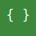

  
  

# 👋 João Pedro Rodrigues  
### Back-End Developer

Sou estudante de **Desenvolvimento de Sistemas (ETEC Zona Leste)**, participante do programa **IBM P-TECH**, com foco em **back-end**: design de APIs REST, bancos relacionais e qualidade de código. Busco **Estágio / Jovem Aprendiz em Back-End**.

📍 São Paulo – SP · ⏰ Estudo 13h–18h  
🧭 Disponível: Remoto · Híbrido · Presencial (preferência manhã)  
🎯 **Aberto a oportunidades**

---

## 🛠️ Tech Stack

**Back-End**
-  Java ·  Python ·  PHP
-  Node.js ·  Express · Fastify  
-  PostgreSQL ·  SQLite · SQL Server  
-  REST APIs ·  JSON ·  XML

**Front-End**  
-  HTML ·  CSS ·  JavaScript

## 🛠️ Ferramentas  

<!-- Insomnia -->

<!-- NetBeans -->

---

## 📌 Projetos de Destaque

### 🔹 VetMate
Plataforma para facilitar o cuidado com a saúde animal: cadastro de pets, agendamento, controle de medicamentos e chatbot para pré-diagnóstico.  
**Tech:** HTML · CSS · JavaScript  
🔗 GitHub: https://github.com/joaocamillis/VetMate

---

### 🔹 Fluxum — IoT + Cloud Dashboard
Dashboard para rastrear movimentações de contêineres em tempo real, integrando IoT (ESP32 + GPS + RFID) com API em Node e banco PostgreSQL.  
**Tech:** Node.js · Express · PostgreSQL · React · Tailwind  
🔗 GitHub: https://github.com/joaocamillis/Fluxum

---

### 🔹 Xarc — Gamificação de Produtividade
Sistema gamificado com missões, ranking e autenticação JWT.  
**Tech:** Node.js · Fastify · PostgreSQL · JavaScript  
🔗 GitHub: https://github.com/joaocamillis/Xarc

---

## 🗺️ Linha do Tempo (resumo)
- **2024** — Início DS AMS (ETEC Zona Leste) · IBM P-TECH  
- **2024** — Projeto **VetMate**  
- **2025** — Projetos **Fluxum** e **Xarc**  
- **2025** — Participação **Venturus** e **CNIT 2025**

---

## 🎓 Formação & Cursos
- **ETEC Zona Leste — DS (3º ano)** · Programa **IBM P-TECH**
- **Python for Everybody (5 cursos – Univ. Michigan)**
- Agile Explorer — IBM SkillsBuild  
- Explorations into Mindfulness — IBM SkillsBuild  
- Working in a Digital World — IBM SkillsBuild  
- TIC – Fundamentos de Tecnologia da Informação e Comunicação (Abr/2025)  
- (Em andamento) **CS50x**

---

## 🏅 Idiomas
- 🇧🇷 Português — Nativo  
- 🇺🇸 Inglês — B1–B2 (boa leitura técnica e comunicação básica em contextos de TI)

---

## 🤝 Aberto a Oportunidades
Estágio / Jovem Aprendiz em **Back-End**.

---

## 📫 Contato
**Email:** joaocomercial2233@gmail.com  
**LinkedIn:** www.linkedin.com/in/joão-pedro-rodrigues-de-camillis-07248136a

---

## 📊 GitHub Insights

> ⚠️ **Aviso**: o gráfico abaixo é calculado por **tamanho de arquivo (bytes)** e pode **não refletir** a experiência real por linguagem.

  
  

### 📈 Uso de Linguagens por **Linhas de Código** (cloc)
> *Estimativa por **linhas de código** agregando **todos os repositórios públicos**. Pode variar conforme pastas ignoradas. Esta métrica é **mais fiel** do que o gráfico por bytes acima.*

<!--LANG-STATS:START-->
| Linguagem | Linhas | % |
|---|---:|---:|
| Text | 120362 | 54.8 |
| JSON | 21538 | 9.81 |
| XML | 18869 | 8.59 |
| CSS | 11367 | 5.18 |
| Python | 9408 | 4.28 |
| JavaScript | 6906 | 3.14 |
| JSX | 5585 | 2.54 |
| HTML | 4953 | 2.26 |
| Java | 3067 | 1.4 |
| Kotlin | 3013 | 1.37 |
| PHP | 2319 | 1.06 |
| SQL | 1653 | 0.75 |
| Bourne Shell | 1511 | 0.69 |
| C | 1459 | 0.66 |
| C++ | 1085 | 0.49 |
